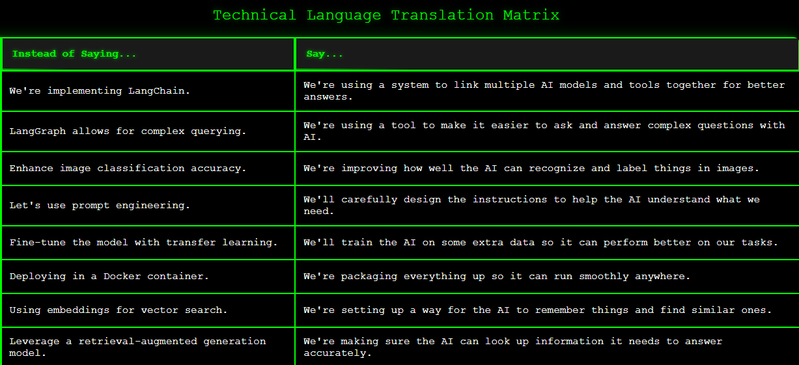

# AI Technical Language Matrix Generator 🤖

A dynamic tool that generates a Matrix-themed HTML table translating complex AI technical terms into simple, human-friendly explanations. Each run produces fresh, LLM-generated content using the Groq API.

## 🚀 Features
- Dynamic content generation using Groq's LLM (llama3-8b-8192)
- Matrix-themed styling with glowing green text and hover effects
- Responsive table design with animated scan lines
- Timestamp-based file generation for tracking different outputs

